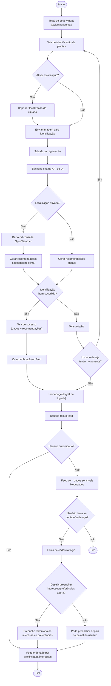

# Diagrama de Atividades — FloraHub

## Fluxo: Da abertura do app até a publicação no feed

```mermaid
flowchart TD
    Start([Início]) --> Boas["Telas de boas-vindas\n(swipe horizontal)"]
    Boas --> Identificar["Tela de identificação de plantas"]

    Identificar --> DecideLoc{Ativar localização?}
    DecideLoc -- Sim --> Localiza["Capturar localização do usuário"]
    DecideLoc -- Não --> EnviaImg["Enviar imagem para identificação"]
    Localiza --> EnviaImg

    EnviaImg --> Loading["Tela de carregamento"]
    Loading --> ChamaIA["Backend chama API de IA"]

    ChamaIA --> DecideLocClima{Localização ativada?}
    DecideLocClima -- Sim --> ChamaClima["Backend consulta OpenWeather"]
    ChamaClima --> GeraRecClima["Gerar recomendações\nbaseadas no clima"]
    DecideLocClima -- Não --> GeraRecGenerica["Gerar recomendações gerais"]

    GeraRecClima --> DecideResultado{Identificação\nbem-sucedida?}
    GeraRecGenerica --> DecideResultado

    DecideResultado -- Sim --> TelaSucesso["Tela de sucesso\n(dados + recomendações)"]
    DecideResultado -- Não --> TelaFalha["Tela de falha"]

    TelaSucesso --> CriaPublicacao["Criar publicação no feed"]
    TelaFalha --> OfereceRetry{Usuário deseja\ntentar novamente?}

    OfereceRetry -- Sim --> Identificar
    OfereceRetry -- Não --> Homepage

    CriaPublicacao --> Homepage["Homepage (logoff ou logada)"]

    Homepage --> RolaFeed["Usuário rola o feed"]
    RolaFeed --> DecideLogado{Usuário autenticado?}

    DecideLogado -- Sim --> FeedOrdenaProximidade["Feed ordenado por\nproximidade/interesses"]
    DecideLogado -- Não --> FeedBloqueado["Feed com dados sensíveis\nbloqueados"]

    FeedBloqueado --> DecideAcao{Usuário tenta ver\ncontato/endereço?}
    DecideAcao -- Sim --> Cadastro["Fluxo de cadastro/login"]
    DecideAcao -- Não --> FimVisita([Fim])

    Cadastro --> DecideCadastroPref{Deseja preencher\ninteresses/preferências agora?}
    DecideCadastroPref -- Sim --> PreencheForm["Preenche formulário de\ninteresses e preferências"]
    DecideCadastroPref -- Não --> PainelDepois["Pode preencher depois\nno painel do usuário"]

    PreencheForm --> FeedOrdenaProximidade
    PainelDepois --> FeedOrdenaProximidade
    FeedOrdenaProximidade --> Fim([Fim])
```
