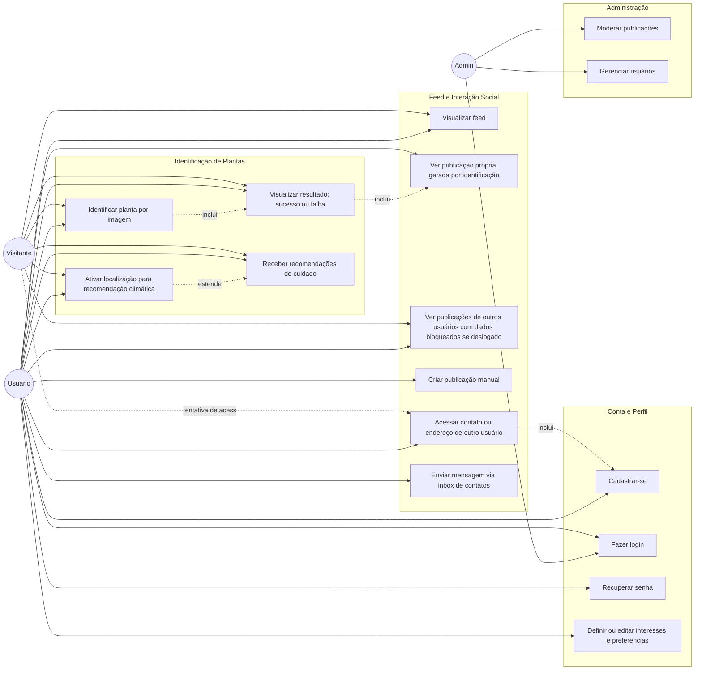

# Diagrama de Casos de Uso — FloraHub

## Descrição dos principais casos de uso

| Caso de uso | Ator(es) | Descrição |
|---|---|---|
| Identificar planta por imagem | Visitante, Usuário | Envio de imagem para identificação via IA, retornando dados da planta. |
| Ativar localização para recomendação climática | Visitante, Usuário | Consentimento de uso da localização para consulta à API OpenWeather. |
| Visualizar resultado (sucesso/falha) | Visitante, Usuário | Exibição do resultado da identificação, com CTA para explorar a homepage. |
| Receber recomendações de cuidado | Visitante, Usuário | Exibição de recomendações associadas à planta identificada (poda, produtos, clima, animais domésticos). |
| Cadastrar-se | Visitante | Criação de conta, com preenchimento opcional de interesses/preferências. |
| Fazer login / Recuperar senha | Usuário, Admin | Autenticação no sistema. |
| Definir/editar interesses e preferências | Usuário | Configuração de interesses, ambiente e experiência no painel do usuário. |
| Visualizar feed | Visitante, Usuário | Consulta de publicações das últimas 24h, ordenadas por proximidade/interesse. |
| Ver publicações de outros usuários | Visitante, Usuário | Visualização de publicações com dados sensíveis ocultos se deslogado. |
| Acessar contato/endereço de outro usuário | Visitante, Usuário | Ação que exige autenticação; visitante é direcionado ao cadastro. |
| Criar publicação manual | Usuário | Publicação não vinculada diretamente a uma identificação recente. |
| Enviar mensagem (inbox/contatos) | Usuário | Comunicação direta entre usuários conectados. |
| Moderar publicações / Gerenciar usuários | Admin | Ações administrativas de manutenção do sistema. |
