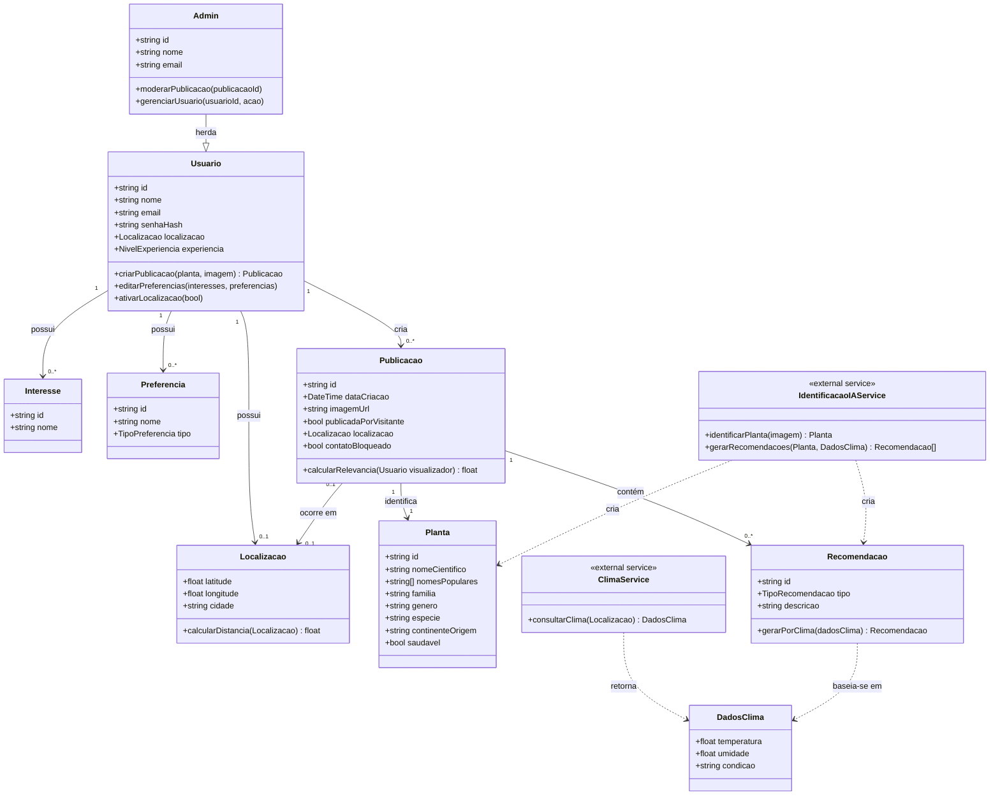

# Diagrama de Classes — FloraHub

## Notas de modelagem

- `Admin` herda de `Usuario` (permissões adicionais de moderação/gestão).
- `IdentificacaoIAService` e `ClimaService` representam as integrações externas (OpenAI e OpenWeather, respectivamente) — modeladas como serviços externos e não como entidades persistidas.
- `Publicacao.contatoBloqueado` reflete a regra de negócio de ocultar dados sensíveis (endereço/contato) para visualizadores não autenticados.
- `Publicacao.calcularRelevancia` representa o critério de ordenação do feed (combinação de proximidade geográfica e interesses em comum), usado pelo algoritmo de recomendação.
- `TipoRecomendacao` (enum sugerido): `PODA`, `PRODUTO`, `CLIMA`, `ANIMAL_DOMESTICO`, `OUTRO`.
- `TipoPreferencia` (enum sugerido): `AMBIENTE` (jardim, apartamento, terraço), `LUMINOSIDADE` (muita/pouca luz), `DISPONIBILIDADE` (muito/pouco tempo).
