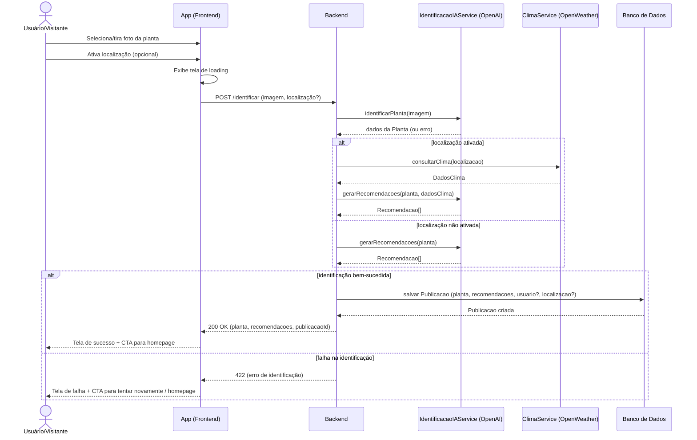
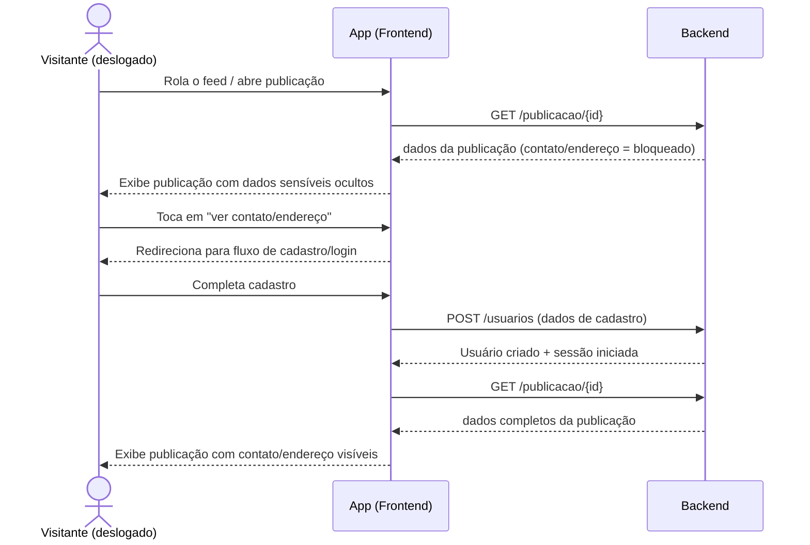

# Diagrama de Sequência — FloraHub

## Fluxo: Identificação de planta com recomendação climática

```mermaid
sequenceDiagram
    actor U as Usuário/Visitante
    participant App as App (Frontend)
    participant BE as Backend
    participant IA as IdentificacaoIAService (OpenAI)
    participant Clima as ClimaService (OpenWeather)
    participant DB as Banco de Dados

    U->>App: Seleciona/tira foto da planta
    U->>App: Ativa localização (opcional)
    App->>App: Exibe tela de loading
    App->>BE: POST /identificar (imagem, localização?)

    BE->>IA: identificarPlanta(imagem)
    IA-->>BE: dados da Planta (ou erro)

    alt localização ativada
        BE->>Clima: consultarClima(localizacao)
        Clima-->>BE: DadosClima
        BE->>IA: gerarRecomendacoes(planta, dadosClima)
        IA-->>BE: Recomendacao[]
    else localização não ativada
        BE->>IA: gerarRecomendacoes(planta)
        IA-->>BE: Recomendacao[]
    end

    alt identificação bem-sucedida
        BE->>DB: salvar Publicacao (planta, recomendacoes, usuario?, localizacao?)
        DB-->>BE: Publicacao criada
        BE-->>App: 200 OK (planta, recomendacoes, publicacaoId)
        App-->>U: Tela de sucesso + CTA para homepage
    else falha na identificação
        BE-->>App: 422 (erro de identificação)
        App-->>U: Tela de falha + CTA para tentar novamente / homepage
    end
```

## Fluxo: Acesso a publicação com dados bloqueados (visitante)

```mermaid
sequenceDiagram
    actor V as Visitante (deslogado)
    participant App as App (Frontend)
    participant BE as Backend

    V->>App: Rola o feed / abre publicação
    App->>BE: GET /publicacao/{id}
    BE-->>App: dados da publicação (contato/endereço = bloqueado)
    App-->>V: Exibe publicação com dados sensíveis ocultos

    V->>App: Toca em "ver contato/endereço"
    App-->>V: Redireciona para fluxo de cadastro/login

    V->>App: Completa cadastro
    App->>BE: POST /usuarios (dados de cadastro)
    BE-->>App: Usuário criado + sessão iniciada
    App->>BE: GET /publicacao/{id}
    BE-->>App: dados completos da publicação
    App-->>V: Exibe publicação com contato/endereço visíveis
```
